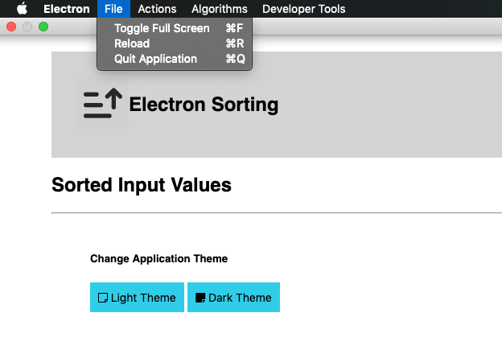
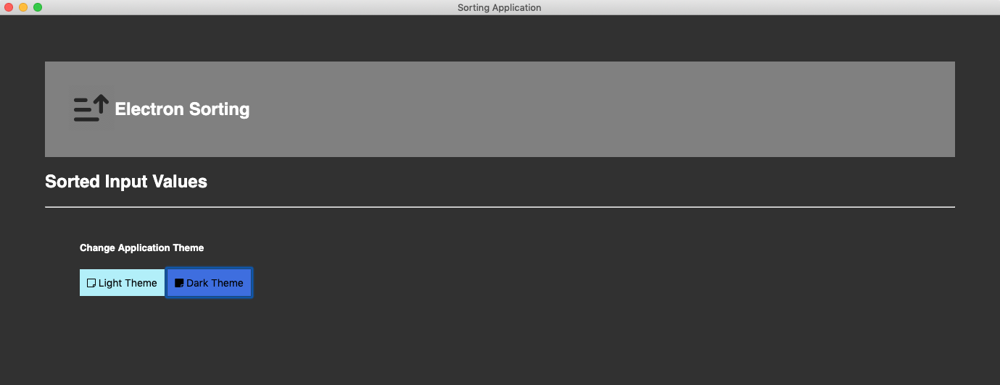

Electron Sorting: A Desktop Numerical Sorting Application.

TABLE OF CONTENTS\
	<pre> INTRODUCTION	</pre>
	<pre> SPECIFICATIONS	</pre>
	<pre> SOFTWARES REQUIRED	</pre>
	<pre> SOURCE CODE	</pre>
	<pre> INSTALLATION NOTES	</pre>
	<pre> ABOUT THE APPLICATION	</pre>

INTRODUCTION\
	This sorting desktop application is built using Electron and NodeJs. It takes a series of comma seperated positive numerical values and sorts them based on the selected sorting algorithm. The sorted values are then displayed in the form of bars with the sequence of iterations that took place.
	  
<b>Check out this video to see the demo.</b>

<pre><i>If the above video doesn't seem to work, you can find the same clip of Demo at (~/readme_figs/DemoVideos/ElectronSortingDemo.mov) location.</i></pre>

SPECIFICATIONS\
	<pre>A desktop application that takes a series of comma seperated numerical values:</pre>
		<ul>
		<li> Have Tabs and Shortcuts for various different option such as Quit, FullScreen, Reload, Sorting Algorithms etc.</li>
		<li> Provide button to enable the 'Light' and 'Dark' themes of the application.</li>
		<li> Have a new window for providing the Numerical input values.</li>
		<li> Display a button "Initiate Sort" to initiate the sorting algorithm. Have 'Insertion Sort' be triggered as default sorting algorithm.</li>
		<li> Display an error message if a non-numerical value is provided or if the values are not seperated by a comma ","</li>
		<li> Assign shortcuts to various Sorting Algorithm available at disposal to the user via the Application. </li>
		<li> Display the sorted values in the form of progress bar on the screen</li>
		<li> Display the iterations of the change in the input series of values taking place during Sorting</li>
		<li> Display a button to clear the contents of the screen</li>
		</ul>
	<pre>When the user clicks the Process Sorting Button:</pre>
	<ul>
	<li> Initiate 'Insertion Sort' by default.</li>
	<li> Re-sort the input values upon the change of selection of Algorithm from the 'Algorithm' tab or by the use of dedicated shortcuts assigned</li>
	<li> Display the sorted series in the form of progress bars.</li>
	<li> Display the series in each iteration below</li>
	<li> Provide a 'Clear All' button which clears the sorted contents.</li>
	</ul>
	<pre>Build the application to generate an executable each for MAC, Windows, Linux:</pre>
			<ul>
			<li> Have a seperate set of commands for the developer to build the executables for Mac OS, Windows OS, Linux OS and all of the three OS </li>
			<li> Have the developer tools option available for debugging to developers.</li>
			</ul>

SOFTWARES REQUIRED\
	The software that are needed for the application to be edited or executed
	<ul>
	<li> OPERATING SYSTEM UTILIZED: MAC OS- Mojave </li>
	<li> ‘technology’ --> Node JS, HTML, JavaScript</li>
	<li> ‘application’ --> Electron.</li>
	<li> ‘build tools’ --> Electron Packager, Wine (for creating Windows build)</li>
	</ul>

SOURCE CODE\
	The Source code for the application is in the ‘ElectronSortingApp’ folder
	<ul>
	<li> ‘src’ --> This folder has the source code for the application which receives, processes and displays the values received from the Frontend.</li>
	<li> ‘screens’ --> This folder has the HTML pages utilized to display the UI to the user.</li>
	<li> ‘assets’ --> This folder has the styling file and the logos needed by our application.</li>
	</ul>

INSTALLATION NOTES\
	All the execution of this application will be done via command prompt terminal. <b>Assuming you have Node, npm and Wine already installed</b>
<ol type="A">
<li> ‘Sorting Application’ </li>
	<ul>
		<li> Navigate into your /ElectronSortingApp/ and install the dependencies using the command  <b>npm install</b>  </li>
		<li> Run the application: <b>electron .  Or   npm start</b></li>
	</ul>
<li> ‘Build’ </li>
	<ul>
		<li> Navigate into your /ElectronSortingApp/ </li>
		<li> Run the following command for Mac OS executable:  <b>npm run build-osx</b></li>
		<li> Run the following command for Windows OS executable:  <b>npm run build-win32</b></li>
		<li> Run the following command for Linux OS executable:  <b>npm run build-linux</b></li>
		<li> Run the following command for Mac. windows, linux OS executable together:  <b>npm run build-all</b></li>
	</ul>
	</ol>

ABOUT THE APPLICATION\
	This application opens up a window after you have installed and initiated the step given in the ‘INSTALLATION NOTES’ section(except the 'Build' section if you are running it locally).
The application loads and opens up a desktop window with no sorted values displayed. Figure 1 shows the screen when the application is loaded.

	Figure 1: Start-up Screen

Figures 2-5 shows the options we have for each tab along with their assigned shortcuts

	Figure 2: Display of the 'File' MENU tab.

	Figure 3: Display of the 'Actions' MENU tab.

	Figure 4: Display of the 'Algorithms' MENU tab.

	Figure 5: Display of the 'Developer tools' MENU tab.

The user can open the Input window by navigating to the 'Actions' tab and selecting the 'Input Values' option. Or by using the 'Option/Alt + E' shortcut key. A new window opens up with default values as shown in Figure 6. The user can change the values and hit the 'Initiate Sort' button.

	Figure 6: Input Window.

Once the user clicks the 'Initiate Sort' button, the sorting algorithm kicks into action, sorts the provided range of input values and displays them as shown in Figure 7. The user can change the values by re-opening the Input window and hit the 'Initiate Sort' button. The user can also choose to Clear the contents rendered by clicking the 'Clear Canvas' button.

	Figure 7: Main Window post Sorting of the inputs.

If the user provides in-appropriate input values then the error message of screen at Figure 8 is shown.

	Figure 8: Error Screen

The application in its 'Dark' theme are the snapshots at Figures 9-11. The user can switch anytime between the 'Light'/'Dark' themes by clicking the respective buttons at the bottom.

	Figure 9: Dark themed Start-Screen

	Figure 10: Dark themed Input Screen

	Figure 11: Dark themed Main Screen

The developer can run the Build commands and the respective executables will be created in the '/dist' location, a folder each for respective target OS.
